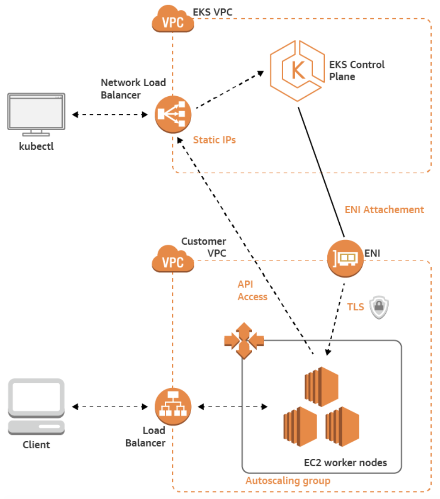
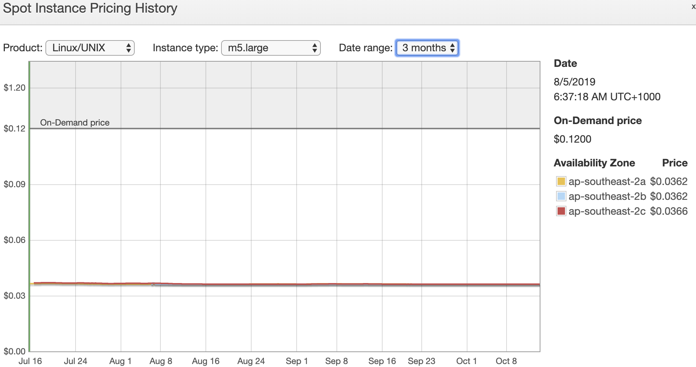
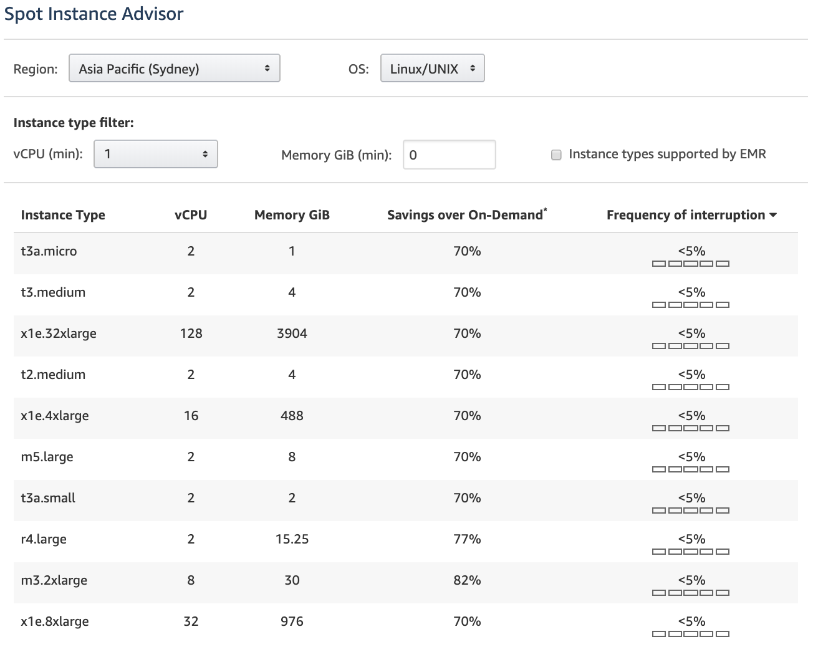
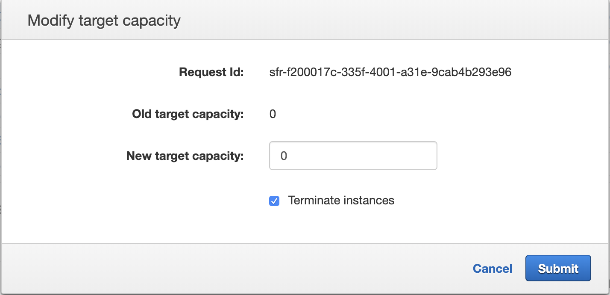

# How to save money running EKS Workers on Spot Instances

# whois

*Caio Trevisan* - Cloud Engineer at Contino

[www.caiotrevisan.com](https://www.caiotrevisan.com)

# Agenda

- [Introduction](#introduction)
    - [AWS AWS Amazon Elastic Container Service for Kubernetes (EKS)](#aws-amazon-elastic-container-service-for-kubernetes-(eks))
    - [AWS EC2 Purchase Options](#aws-ec2-purchase-options)
    - [AWS Spot Instances](#aws-spot-instances)
    - [AWS Spot Fleet](#aws-spot-fleet)
    - [AWS Auto Scaling Group](#aws-auto-scaling-group)
- [Use Cases](#use-cases)
    - [peak traffic](#peak-traffic)
    - [batch jobs](#batch-jobs)
    - [failover](#failover)
    - [CICD private runners](#cicd-private-runners)
    - [intensive tasks](#intensive-tasks)
    - [state persistence](#state-persistence)
- [How to Achieve That?](#how-to-achieve-that?)
    - [Cluster AutoScaler (CA)](#cluster-autoscaler-(ca))
    - [Spot Interrupt Handler](#spot-interrupt-handler)
    - [Horizontal Pod Autoscaler (HPA)](#horizontal-pod-autoscaler-(hpa))
    - [Affinity/Taints/Tolerations](#affinity/taints/tolerations)
    - [Kubernetes Operational View](#kubernetes-operational-view)
- [Lab Demos](#lab-demo)
    - [demo 1 - spot termination notice](#demo-1---spot-termination-notice)
    - [demo 2 - cluster auto scaling](#demo-2---cluster-auto-scaling)
- [Tips](#tips)
- [Bonus CKA & CKAD](#bonus-cka-&-ckad)
- [References](#references)

# Introduction

## AWS Amazon Elastic Container Service for Kubernetes (EKS)



- Multi-AZ Kubernetes control plane deployment managed by AWS
- auto-healing
- ondemand patching and upgrades
- ~$150USD/monthly

- need workers -- pay separately

[AWS EKS Documentation](https://aws.amazon.com/eks/)

## AWS EC2 Purchase Options

- On-Demand: pay by the hour or second  
- Reserved Instances: up to 75% discount, one to three-year commitment
- Spot Instances: bid for spare EC2 capacity, up to 90% discount

[AWS EC2 Pricing Documentation](https://aws.amazon.com/ec2/pricing/)

## Spot Instances

- predictable pricing
- up to 90% of savings
- termination notice
    - ~2 minutes -- metadada warning

Good use for:

- Flexible start/end times
- Applications that handle well failure
- Large computing needs for jobs like data processing

[AWS EC2 Spot Instances Documentation](https://aws.amazon.com/ec2/spot/)

### Pricing History

Pricing of a `m5.large` instance from `Jul/19` to `Oct19` in region SydneyAU `ap-southeast-2`.

|Instance Type|Price|
|-|-|
|On-demand|0.12|
|Spot|0.0362|



### Spot Instance Advisor



[AWS Spot Instances Advisor](https://aws.amazon.com/ec2/spot/instance-advisor/)


## Spot Fleet

- collection/group/fleet of spot instances
- request is fulfilled either by reaching target capacity or exceeding the maximum price

### Spot Fleet Request

- one-time / maintain
- launch specifications: instance types / az (up to 50)
- target capacity
- on-demand portion
- defined price vs on-demand price

[AWS Spot Fleet Documentation](https://docs.aws.amazon.com/AWSEC2/latest/UserGuide/spot-fleet.html)

# Use cases

## peak traffic

- two set of worker nodes
    - spot: scale up above 70% of load
    - ondemand: scale up above 90% of load

PS.: think ahead and overprovision in case of any expected event

## batch jobs

- queue requests on SQS or any other queue service
- scale workers based on quantity of jobs queued

## failover

- Taint spot workers with `PreferNoSchedule` so jobs will run first on ondemand workers and only if not resources available will use Spot anyway

## CICD private runners

- as non-critical services that can retry in case of failing make a good use case for savings

## intensive tasks

- Western Digital has run a simulation of close to 2.5million tasks in just 8 hours with more than 50k instances (1 million vCPU!!) costing around $140kUSD. Estimated in half of the costs of running even on in-house infrastructure.
- S3 were used to save data results and checkpoints when the instance were schedule to terminate

## state persistence

- use lambda with cloudwatch events or builtin application function for:
    - re-assigning elastic IP 
    - load balancer handling
    - update DNS entries
    - any environment changes

# How to Achieve That?

## Cluster AutoScaler (CA)

- scale up/down NODES when pods are not able to be scheduled
    - keeps checking for pendind pods
- send a api call to the ASG when scale is needed
- userdata/scripts insert the new node to the cluster
- kubernetes allocate pods to newly added nodes
- CA is not based on actual load but instead in `requests/limits`
    - how much memory/cpu you allocate to a pod

### CA Installation

- Update your ASG name so the service can trigger the scale up/down for you

`sed -i '' "s/<INSERT-YOUR-SPOT-INSTANCES-ASG-NAME-HERE>/test/g" "k8s-tools/cluster-autoscaler/cluster_autoscaler.yml"`

- Run the CA deployment

`kubectl apply -f k8s-tools/cluster-autoscaler`

- Watch logs

`kubectl logs -f deployment/cluster-autoscaler -n kube-system`

## Spot Interrupt Handler

- run as daemonsets
- keep polling instance metadata for termination notice
- drain the node -- taint as NoSchedule
- node can be gracefully removed

### SIH Installation

- Run the Spot Interrup Handler Daemonset

`kubectl apply -f k8s-toolks/spot-interrupt-handler`

## Horizontal Pod Autoscaler (HPA)

- Auto scale at pod level based on cpu utilisation
- query utilisation every 15 seconds

[Kubernetes HPA Documentation](https://kubernetes.io/docs/tasks/run-application/horizontal-pod-autoscale-walkthrough/)

### HPA Installation

- Install metrics server for pod load monitoring

`helm install stable/metrics-server --name metrics-server --version 2.0.2 --namespace metrics`
 
- Create a test deployment and expose it

`kubectl run php-apache --image=k8s.gcr.io/hpa-example --requests=cpu=200m --limits=cpu=500m`

- Create deployment autoscaler

`kubectl autoscale deployment php-apache --cpu-percent=30 --min=1 --max=10`

- Expose the service

`kubectl expose deploy php-apache --target-port=80 --port=80 --type=LoadBalancer`

- Increase load

```bash
kubectl run -i --tty load-generator --image=busybox /bin/sh

Hit enter for command prompt

while true; do wget -q -O- http://php-apache.default.svc.cluster.local; done
```

- Monitor HPA and deployment

`kubectl get hpa -w`

`kubectl get deployment php-apache -w`

## Affinity/Taints/Tolerations

- affinity attracts pods to a set of nodes
    - create rules based on labels to: 
        - hard: need to match label 
        - soft: preference to match but not required
- taints allow nodes to repel pods
- tolerations are applied to pods to allow (not require) schedule with matching taints

[Taints and Tolerations](https://kubernetes.io/docs/concepts/configuration/taint-and-toleration/)

### Example

- Node tainted with NoSchedule

`kubectl taint nodes node1 key=value:NoSchedule`

- A pod needs a toleration to be able to run on that node

```yaml
tolerations:
- key: "key"
  operator: "Exists"
  effect: "NoSchedule"
```

- Hard and soft affinities:

```yaml
affinity:  
    nodeAffinity: 
        requiredDuringSchedulingIgnoredDuringExecution: 
            nodeSelectorTerms: 
            - matchExpressions: 
                - key: jobType 
                operator: In 
                values: 
                - batch 
        preferredDuringSchedulingIgnoredDuringExecution: 
        - weight: 1 
        preference: 
            matchExpressions: 
            - key: instanceType 
            operator: In 
            values: 
            - Ec2Spot
```

## Kubernetes Operational View

- Visual graphics of cluster working
- good for learning and dashboards

[Kubernetes Operational View Documentation](https://github.com/hjacobs/kube-ops-view)

### KOV Installation

- Instal via helm

```
helm repo update
helm install stable/kube-ops-view --name kube-ops-view --set service.type=LoadBalancer --set rbac.create=True
```

- Get service url

`kubectl get svc kube-ops-view | tail -n 1 | awk '{ print "Kube-ops-view URL = http://"$4 }'`

# Lab Demo

- cluster created with `eksctl` using all default settings

`eksctl create cluster caio-eks-test`

- deploy [CA](#ca-installation), [Spot Interrupt Handler](#sih-installation), [metrics server](#hpa-installation) and [Kubernetes Operational Viewer](#kov-installation) to your cluster
- run `kubectl apply -f k8s-tools/monte-carlo.yaml` so it can fill existing nodes with workloads

## demo 1 - spot termination notice

- spot instance workers via Spot Fleet Request using terraform

### USE AT YOUR OWN RISK - EXAMPLE POLICIES ARE VERY PERMISSIVE 

- go to `tf-spot-workers` folder and update variables according to your recently create EKS cluster before applying

- wait until the new instance joins the cluster

- run a nginx pod and expose it

```
kubectl run nginx --image=nginx
kubectl expose deployment nginx --port=80 --target-port=80 --type=LoadBalancer
```

- make sure the `nginx` replica is running on the spot instance node

- run `test_url.sh <service-url>` for constant polling the url

- go to AWS console Spot Fleet Requests and modify the fleet target capacity to 0
    - this will trigger the termination notice



- observe:
    - the pod needs to be reallocated to a healthy node before the node is removed
    - service will have little to none interruption on the polling

## demo 2 - cluster auto scaling

- run [HPA load test steps](#hpa-installation) to create a `php-apache` pod and generate some load

- behaviour to expect/monitor through the dashboard:
    - HPA scale deployment replicas based on CPU load
    - once no nodes available for schedule pods, CA should scale up the cluster


# Tips

### ebs volumes

- ebs volumes cannot span multiple aws availability zone
- use either Affinity rules and/or taint/tolerations to force use of nodes
- efs for multiaz agnostic

### Cluster Autoscaler (CA)

- currently does not support multi az
    - one ASG per az and enable `--balance-similar-node-groups` feature
- require to exists `/etc/ssl/certs/ca-bundle.crt` in your cluster.
    - tools like `kops` need customization
- by default CA won't move pods on `kube-system` namespace
    - you can change this behaviour
- you can overprosion with `pause pods`
- keep pods with `requests/limits` close to real needs
- avoid local storage

# Bonus CKA & CKAD

[Contino Ultimate Guide to Passing the CKA Exam](https://www.contino.io/insights/the-ultimate-guide-to-passing-the-cka-exam)

- best content around -- Linux Academy CKA course 
- keep track of questions and weight as you go on the notepad
    - skip if it's too hard and worth less than 5%
    - you only need 74% and 66% to pass
- bookmarks for Kubernetes documentation
- no need for auto-completion as the terminal comes pre-configured
- you can split view your browser with k8s documentation and the exam (only these two tabs open)
- book exam in the morning so you are 100% for a 3 hours exam
- basic set of aliases on `.bash_profile` first thing once the test start

```
alias k='kubectl'
alias kgp='k get po'
alias kgd='k get deploy'
alias kgs='k get svc'
alias kcc='k config current-context'
alias kuc='k config use-context'
alias ka='k apply'
alias kc='k create'
alias kd='k delete'
alias kg='k get'
```

# References

- Spot Instances termination notices:
https://aws.amazon.com/blogs/aws/new-ec2-spot-instance-termination-notices/

- Running EKS workloads on Spot Instances:
https://aws.amazon.com/blogs/compute/run-your-kubernetes-workloads-on-amazon-ec2-spot-instances-with-amazon-eks/

- AWS Spot Instances Pricing Advisor:
https://aws.amazon.com/ec2/spot/instance-advisor/

- Using Spot Instances for cost optimizations:
https://d1.awsstatic.com/whitepapers/cost-optimization-leveraging-ec2-spot-instances.pdf

- Purchase options types on ASG:
https://docs.aws.amazon.com/en_pv/autoscaling/ec2/userguide/asg-purchase-options.html#asg-allocation-strategies

- Using EKSCTL with existing iam and vpc:
https://eksctl.io/examples/reusing-iam-and-vpc/

- Spot Instances termination notice handler:
https://github.com/kube-aws/kube-spot-termination-notice-handler

- Overprovisioning with Cluster Autoscaler (CA):
https://github.com/kubernetes/autoscaler/blob/master/cluster-autoscaler/FAQ.md#how-can-i-configure-overprovisioning-with-cluster-autoscaler

- Gotchas when using Cluster Autoscaler (CA):
https://github.com/kubernetes/autoscaler/tree/master/cluster-autoscaler/cloudprovider/aws#common-notes-and-gotchas

- Re:Invent 2018 Spot Instances with EKS:
https://www.slideshare.net/AmazonWebServices/amazon-ec2-spot-with-amazon-eks-con406r1-aws-reinvent-2018

- AWS Getting Started with EKS:
https://aws.amazon.com/getting-started/projects/deploy-kubernetes-app-amazon-eks/

- AWS Quickstart EKS:
https://s3.amazonaws.com/aws-quickstart/quickstart-amazon-eks/doc/amazon-eks-architecture.pdf

- Kubernetes Docs:
https://kubernetes.io/docs/

- kubectl drain:
https://kubernetes.io/images/docs/kubectl_drain.svg

